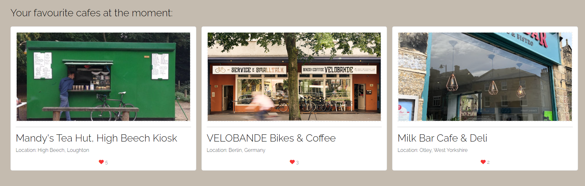
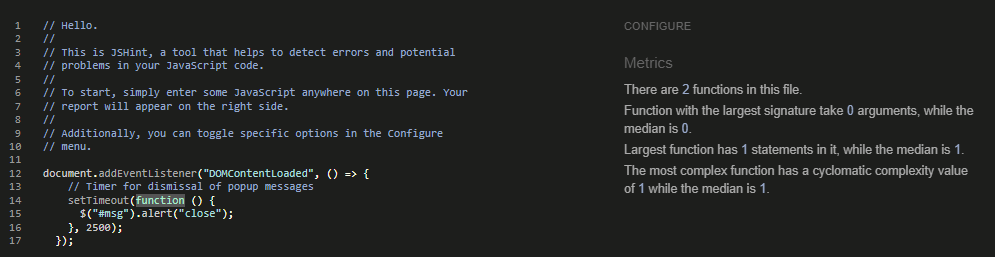

# Café Stops


Cafes stops is an online app designed to connect people interested in cycling and café culture. All users have access to browse and view published posts but users must be registered to interact with content e.g. make posts, like posts or comment. Registered users can submit posts to the site via a submission form and update or delete them from the site. Each post is viewable on the site following authorisation by admin. Posts have categories that link them together which users can search through.

[The deployed app can be found here]( https://cafe-stops-app-1a89f942fe7e.herokuapp.com/)

## Contents

1. [User Experience (UX)](#1-user-experience-ux)
2. [Agile Development](#2-agile-development)
3. [Design](#3-design)
4. [Features](#4-features)
5. [Technologies Used](#5-technologies-used)
6. [Testing](#6-testing)
7. [Local Development and Deployment](#7-local-development-and-deployment)
8. [Credits](#8-credits)

## 1. User Experience (UX)

### User Stories

#### Epic

#### Post Creation
As a site user I can create, read, update and delete blog posts so that I can share cycling cafes
1. As a site user I can create a new post so that I can share it with other users
2. As a site user I can edit a post so that I can update the information if it changes
3. As a site user I can read the content of posts so that I can be informed and interact with the content
4. As a site user I can add images to my posts so that I can give a visual account of a café
5. As a site user I can delete a post so that I can manage my content
6. As a site user when I submit a post the action is confirmed so that I can know it is posted
7. As a site user when I edit a post the action is confirmed so that I can know it is edited
8. As a site user when I delete a post the action is confirmed so that I know it has been deleted

#### Comments
As a site user I can create, read, update and comments on posts so that I can add to discussion on cafes
1. As a site user I can view comments on a post so that I can read the discussion
2. As a site user I can make a comment on a post so that I can be involved in the discussion
3. As a site user I can delete my comment so that I can update the content
4. As a site user I can edit my comment so that I can be update the content

#### Like/unlike
As a site user I can like/unlike a blog post so that I can interact with the site content.
1. As a site user I can view the number of likes on each post so that I can see which is the most popular and feel part of a community
2. As a site user I can like a post so that I can interact with the content and indicate if I support a café
3. As a site user I can unlike a post so that I can interact with the content and indicate if I don't support a cafe
4. As a site user when I like a post the action is confirmed so that I can know it is liked

#### Site admin
As a site admin I can manage the blog so that the integrity and quality is maintained
1. As a Site Admin I can create, read, update and delete blog posts and comments so that I can manage the content

#### Account registration
As a site user I can register for an account so that I can access all the blog features.
1. As a site user my registration is confirmed so that I can access all site user features
2. As a site user when I login this is confirmed so that I can know I am logged in

#### Categories
As a site user I can add and search categories so that I can see related features of cafes
1. As a site user I can select a category for my post so that I can indicate shared features of a café
2. As a site user I can search through categories of posts so that I can see related features of cafes

#### UX/design 
As a site user I can use the site because it has a well-designed user interface that makes a good user experience
1. As a site user I can get an overall understanding and impression of the site because user experience design, accessibility and responsivity principled are employed so that I can quickly determine the purpose of the site and continue using it
2. As a site user I can use the site on the different devices so that I can still access all functionality.
3. As a site user I am presented with a hero image so that I can identify with the content
4. As a site user I am presented with a link to the developer’s other projects so that I can access more content
5. As a site user I can view a gallery section  with most liked posts so that I can easily see any new activity
6. As a site user I can view a favicon so that I can navigate web tabs in the browser
7. As a site user I can access a description of the site so that I understand the purpose and scope
8. As a site user I can be shown error pages so that made aware of page errors

#### Software technologies
As a site user I can use requisite software technologies so that I can interact with the cafe stop app
1. As a site user I can use a front end app so that I can send and get date from a back end database
2. As a site user I access a backend database so I can interact and use a frontend app

## 2. Agile Development

This project was developed using Agile methodology.

To manage the development process GitHub Issues and Projects including a Kanban board. MosCow approaches were used to determine must have, could have and should have features. Each part of the app is broken down into epics, user stories, tasks and acceptance criteria. Git hub milestones were also used to measure progress.


[The Project Kanban Board]( https://github.com/users/MattuW4/projects/5/views/1)

## 3. Design

### Structure

The below diagram shows the consideration for how a user would navigate through the prospective website features that informed and underpinned the development and implementation during the project.


### Wireframes

In the initial stages of scoping wireframes were used to conceptualise and aid development of pages for the site that then informed the code development.

- [index](documentation/design/wf-home.png) 
- [browse](documentation/design/wf-browse.png)
- [add post](documentation/design/wf-add.png)
- [post detail](documentation/design/wf-post.png)
- [sign in/up](documentation/design/wf-sign.png)

### Colour Scheme


Cooler was utilised to select a colour scheme.

[Coolors](https://coolors.co/).

### Typography

[Google Fonts](https://fonts.google.com/) was used to add the fonts, specifically Raleway and Roboto.

### Imagery and Icons

The images, icons and logo were chosen to give context and create something relatable

All icons were sourced from [Font Awesome](https://fontawesome.com/).

## 4. Features

### Navigation bar & footer

The Nav Bar has been developed to be responsive to authentication of a user depending on whether they are logged in or out. Sign in/out features only appear when a user is logged out with the sign out and post creation features only being present when a user is logged in. Similarly, the identity of a user is displayed when a current user is logged in. There is a drop down menu to allow users to search by predetermined categories for all cafes on the site. The Nav Bar appears across the site for access.

#### Logged out


#### Logged in


#### Footer

The footer is present across the site and contains social media links as well as that to the git hub of the developer.


### Home Page

The Home or landing page contains a hero image as well as a short blurb containing hooks in order to immediately orientate the user to the purpose of the site and make an emotional connection. These features also give the user an idea of how the site could be utilised. There are links to sign in or sign up if a user is logged out within the blurb based on authentication whilst these links are replaced by a link to the browse page if a user is logged in.


There is a gallery feature at the bottom of the homepage that shows all users the 3 most liked posts of cafes on the site, allowing them to access these from the front page.



### 'Browse' Page

The browse page is a paginated list of all posts made by users on the site ordered by most recent date. There are buttons that appear at the bottom of the 6 card browse view that enables users to navigate forward and backward through the list


### Categories Page

The categories page can be navigated to via the categories drop down menu with the Nav Bar available across the site or by a user clicking on the respective categories assigned to a specific post within the post detail view. Only those posts assigned to that category will be displayed on the category page in contrast to the browse page that displays all posts. The posts are sorted and displayed by most recent date.


### Post Card Detail Page

Each post entry has a card that appears across the site on the home page and on the browse or category views. It contains a high level summary of information that immediately informs a user about a post, with further detail being available within said post.


### Post Details Page

Each post has its own detail page view that contains information about location, social media, opening times, category, description, likes as well as the comment panel. 


If a user is logged in and owns a post and they are authenticated, then they are presented with the edit and delete options for said post that are otherwise hidden from other users.


Within the post detail view an authenticated and logged in user can like or unlike a post with the button changing depending on state as well as the like counter updating. If a user is not logged in then this feature does not appear but the count of likes is still rendered.


Users authenticated as logged in can create comments. These comments are sent to the site admin to approve. If a user tries to post a comment without content then a popup notifies them of this and the form cannot be submitted.


### Add/update Page

If a user is authenticated and logged in, then they are able to navigate to the post create page and complete the form to create a post. If there are fields that are required that a user omits then they receive a prompt and cannot submit the form. The approval of said post is sent to the site admin.


If a user does not upload an image, then a placeholder one is assigned to the database entry.


If a user is authenticated as logged in and a post owner, then the feature to update or delete the post is shown. They can navigate to the update post form that is prepopulated with existing detail to edit.


If a user is authenticated as logged in and a post owner, then the feature to delete the post can be enacted which will remove a post from the site. A user is warned that the action is not reversible and is also given the option to navigate away from the delete page.


### User Authentication, register, log in & out 

As mentioned in the feature sections there are certain elements available to a user if they are authenticated as logged in or out, or whether they own a post or not. 
#### Register

#### Log in

####Log out


### Field errors and update messages

If required fields are not populated in a form, then a user is notified through a pop up feature.


Only logging in/out, submission of a comment or editing/deletion of a post a user will be notified of the action by a bootstrap pop up message that is displayed for 2.5seconds before disappearing.


### Admin Panel

A super user can access the site admin panel to authorise and update site information.


### Error Pages

Custom error pages are implemented for the site with examples below provided.


### Mobile drop down

The site is designed with mobile first in mind with one significant feature being the collapsible burger button included in the Nav Bar at smaller resolutions where as a result of site responsivity.


## Data Models

The site uses a relational database to store and manage data. The relational database management system software used for this project is [PostgreSQL](https://www.postgresql.org/). This is hosted on the cloud service [ElephantSQL](https://www.elephantsql.com/).

#### Post Model

Title - a CharField with a maximum of 50 characters that must be unique.

Slug - an autopopulated field that uses django-autoslug.

Author - a ForeignKey linking the post to the user model of the user who created it.

Location – a CharacterField with max length100.
 
Opening time – an IntegerField that defaults to 12am unless a user enters a different selection.

 Closing time - an IntegerField that defaults to 12am unless a user enters a different selection.
 
Website – a URLField that can be blank with a max length of 100 characters.

Featured image - a CloudinaryField which contains the URL to the image that is stored on the Cloudinary server with a placeholder.

Content - a TextField. This field is not required.

Created on - a DateTimeField that autopopulates with the current date and time when a recipe is created.

Updated on - a DateTimeField that autopopulates and updates with the current date and time when a recipe is updates.

Status - a IntegerField. Defaults to 'Unpublished'.

Likes - a ManyToManyField linking user models to posts that user has liked.

Category – a ForeignKey linked to the category model selected by a user.

#### Comment Model

Author - a ForeignKey linking the author to the user model of the user who created it.
 
Post – a  ForeignKey linking the post to the user model of the user who created it.
Created_on - a DateTimeField that autopopulates with the current date and time when a recipe is created.

 Approved – a BooleanField.

#### Category Model

Name – a Character Field with max length of 30.

#### Entity Relationship Diagram

The Entity Relationship Diagram (ERD) below shows the database structure and relationships between tables.


### Static File Storage

Cloudinary cloud services were used to store static files. 


### Future features

- Add functionality for authenticated users to edit and delete comments.
- Add search functionality for fields across site
- Add a profile page 
- Use React to create more dynamic, component based features across site

## 5. Technologies Used

### Languages

- [HTML5](https://en.wikipedia.org/wiki/HTML5)
- [CSS3](https://en.wikipedia.org/wiki/CSS)
- [JavaScript](https://en.wikipedia.org/wiki/JavaScript)
- [Python](https://en.wikipedia.org/wiki/Python_(programming_language))

### Frameworks, Libraries and Packages

- [Django 3.2.23](https://docs.djangoproject.com/en/3.2/)
- [Bootstrap 5](https://getbootstrap.com/)
- [jQuery 3.2](https://releases.jquery.com/)
- [Font Awesome 5.15.4](https://fontawesome.com/)
- [Google Fonts](https://fonts.google.com/)
- [django-crispy-forms](https://django-crispy-forms.readthedocs.io/en/latest/)
- [cripsy-bootstrap5](https://github.com/django-crispy-forms/crispy-bootstrap5)
- [django-allauth](https://django-allauth.readthedocs.io/en/latest/)
- [django-autoslug](https://django-autoslug.readthedocs.io/en/stable/)
- [coverage](https://coverage.readthedocs.io/en/7.2.7/)

### Tools

- [Git](https://git-scm.com/)
- [GitHub](https://github.com/)
- [GitPod]( https://www.gitpod.io/) 
- [Heroku](https://heroku.com/)
- [ElephantSQL](https://www.elephantsql.com/)
- [Cloudinary](https://cloudinary.com/)
- [Lucidchart](https://www.lucidchart.com/pages)
- [Coolors](https://coolors.co/)
- [CloudConvert](https://cloudconvert.com/)
- [Tiny PNG](https://tinypng.com/)
- [Am I Responsive](https://ui.dev/amiresponsive)
- [Favicon](https://favicon.io/)
- [The W3C Markup Validation Service](https://validator.w3.org/)
- [The W3C CSS Validation Service](https://jigsaw.w3.org/css-validator/)
- [Code Institute Python Linter](https://pep8ci.herokuapp.com/)
- [JSHint](https://jshint.com/)
- [Chrome DevTools](https://developer.chrome.com/docs/devtools/)
- [Coverage](https://coverage.readthedocs.io/)
- [Wave](https://wave.webaim.org/)


## 6. Testing

[Chrome DevTools](https://developer.chrome.com/docs/devtools/) was frequently utilised.

### Manual Functionality Testing & User Stories

| User Story | Acceptance Criteria | Status |
|------------|---------------------|--------|
|POST CRUD|||
| As a site user I can create a new post so that I can share it with other users |<ol><li>Only an authenticated user who is logged in can create a post</li><li>The created post is logged to the database for a site admin to approve</li></ol>|&check;<br>&check;|
| As a site user I can edit a post so that I can update the information if it changes|<ol><li>Only an authenticated user who is logged in and a post owner can access the edit a post page</li><li>A signed in and post owner who is authenticated can edit a post</li></ol>|&check;<br> &check;|
| As a site user I can read the content of posts so that I can be informed and interact with the content|<ol><li>Any site user can access the browse page to view the content of a post</li><li>Any site user can access the category page to view the content of a post</li><li>Any site user can access the post detail page to view the content of a post</li></ol>|&check;<br> &check;<br> &check;|
| As a site user I can add images to my posts so that I can give a visual account of a café|<ol><li>A logged in authenticated user can upload images to post they create</li><li>If a logged in, authenticated user does not upload an image with their post then a placeholder is used instead</li></ol>|&check;<br> &check; |
| As a site user I can delete a post so that I can manage my content|<ol><li>Only an authenticated user who is logged in and a post owner can access the delete a post page</li><li>A signed in and post owner who is authenticated can delete a post</li><li>Data associated with the post is removed from the database on deletion</li>|&check;<br>&check;<br> &check;|
| As a site user when I submit a post the action is confirmed so that I can know it is posted|<ol><li>Pop up message prompts a user that they have created a post</li></ol>|&check; |
| As a site user when I edit a post the action is confirmed so that I can know it is edited|<ol><li>Pop up message prompts a user that they have edited a post</li><li>Data associated with the post in the databse is updated</li></ol>|&check;<br>&check; |
| As a site user when I delete a post the action is confirmed so that I know it has been deleted|<ol><li>Pop up message prompts a user that they have deleted a post</li></ol>|&check; |
|COMMENTS|||
|As a site user I can view comments on a post so that I can read the discussion|<ol><li>A site users can view comments on a post detail page</li></ol>|&check;|
|As a site user I can make a comment on a post so that I can be involved in the discussion|<ol><li>A logged in authenticated user can create a comment on any post</li><li>The comment a user creates has to be authorised by the administrator of the site</li></ol>|&check;<br> &check;|
| As a site user I can delete my comment so that I can update the content|<ol><li>Functionality not implemented in the project so not available to test</li></ol>|&#10006; |
|As a site user I can edit my comment so that I can be update the content|<ol><li>Functionality not implemented in the project so not available to test</li></ol>|&#10006; |
|LIKES/UNLIKES|||
|As a site user I can view the number of likes on each post so that I can see which is the most popular and feel part of a community|<ol><li>All site users can see the like count displayed on post detail pages, post preview cards and in the highest like gallery on the front page</li></ol>|&check; |
|As a site user I can like a post so that I can interact with the content and indicate if I support a café|<ol><li>An authenticated, signed in user can like a post that they have not already liked</li></ol>|&check; |
|As a site user I can unlike a post so that I can interact with the content and indicate if I don't support a cafe|<ol><li>An authenticated, signed in user can unlike a post they have previously liked</li></ol>|&check; |
|As a site user when I like a post the action is confirmed so that I can know it is liked|<ol><li>When an authenticated, signed in user interacts with a like button it’s status and render changes to reflect a like/unlike and the like counter increases/decreases respectively</li></ol>|&check; |
|SITE ADMIN|||
|As a Site Admin I can create, read, update and delete blog posts and comments so that I can manage the content|<ol><li>An authenticated and logged in site admin has access to CRUD functionality over all posts and comments in the site admin panel in order to manage site content</li><li>Only a logged in and authenticated site admin can access the admin page</li></ol>|&check;<br>&check;|
|ACCOUNT REGISTRATION|||
|As a site user my registration is confirmed so that I can access all site user features|<ol><li>A site user is prompted that they are registered in if they have a profile, providing access to all functionality.<li>If they are not registered then they are directed to the registration page to create a profile</li></ol>|&check;<br> &check; |
|As a site user when I login this is confirmed so that I can know I am logged in|<ol><li>A site user is prompted that they are logged in if they have a profile and are authenticated, providing access to all functionality.<li>If they are not registered then they are directed to the registration page to create a profile</li></ol>|&check;<br> &check; |
|CATEGORIES|||
|As a site user I can select a category for my post so that I can indicate shared features of a café|<ol><li>Any site user can navigate to a specific category via the post detail page by clicking on the category name link to discover more posts related to that category.</li></ol>|&check; |
|As a site user I can search through categories of posts so that I can see related features of cafes|<ol><li>Any site user can access the category drop down menu and select a category to navigate to</li></ol>|&check;<br> &check; |
|UX/DESIGN|||
|As a site user I can get an overall understanding and impression of the site because user experience design, accessibility and responsivity principled are employed so that I can quickly determine the purpose of the site and continue using it|<ol><li>Navigation buttons, links, pagination buttons and back buttons (to navigate away from an edit form) are present and functional across the site</li></ol>|&check; |
|As a site user I can use the site on the different devices so that I can still access all functionality. |<ol><li>Site is responsive across different resolution sizes and web browsers</li></ol>|&check; |
|As a site user I am presented with a hero image so that I can identify with the content|<ol><li>Hero image is displayed on the front page of the site</li></ol>|&check; |
|As a site user I am presented with a link to the developer’s other projects so that I can access more content|<ol><li>Link is available to all users in the footer</li></ol>|&check; |
|As a site user I can view a gallery of the most liked posts so that I can easily see any new activity|<ol><li>All site users can see the gallery of most liked posts on the home page.</li></ol>|&check; |
|As a site user I can view a favicon so that I can navigate web tabs in the browser|<ol><li>Favicon is available in browser tab</li></ol>|&check;|
|As a site user I can access a description of the site so that I understand the purpose and scope|<ol><li>Blurb is available to all users on the home page of the site.</li><li>Blurb content changes dependent on whether a user is registered, logged in or out.</li></ol>|&check;<br> &check;|
|As a site user I can be shown error pages so that made aware of page errors|<ol><li>Error pages are displayed when a user triggers a 404, 403, 405 & 505 event</li></ol>|&check;|
||||


#### Unit Tests and Coverage

The automated tests were written using Django's built-in testing framework which use Python's unittest module. By default Django uses SQLite for the app database, this was used for development purposes and performing automated tests. The test files can be found in the app directory.

The coverage report was generated using the [Coverage](https://coverage.readthedocs.io/) tool.


### Browser Compatibility

The website was tested for functionality on different browsers (Chrome, Firefox and Edge). It was determined to be functional across all.

### Device Compatibility and Responsiveness

The app was tested on the following devices, using Chrome DevTools at different resolutions:

- iPhone SE
- iPhone 12 Pro
- Pixel 5
- Samsung Galaxy S8+
- Samsung Galaxy S20 Ultra
- iPad Air
- iPad Mini
- Surface Pro 7
- Surface Duo
- Galaxy Fold
- Samsung Galaxy A51
- Nest Hub
- Nest Hub Max
- iPad
- iPadPro

## W3C HTML Validator Testing

The [W3C Markup Validation Service](https://validator.w3.org/) was used to validate the HTML files.

All possible validation issues flagged in the validator were resolved that included improper syntax wrapping using a strong tag; form inside a <p> tag; and isolated closing tags for structural HTML elements. Persisting validation issues remained on the post card detail view and the create/edit post due to the unresolved bugs referenced in the later section (potentially caused by Summernote). 

## W3C CSS Validator Testing

The [W3C CSS Validation Service](https://jigsaw.w3.org/css-validator/) was used to validate the CSS with no errors being identified.


### Python Linter

The Code Institute Python Linter was used to validate and format the python files. All errors were fixed with no errors in final deployment. The main form, models and views as well as the test environment form, model and views were validated with evidence provided below:
#### Main


#### Test environment


### JSHint JavaScript Validator Testing

This was used to test the script.js file. Undefined variables was turned off to fix the detection issue with flagging the ‘$’ as an undefined variable. There were no validation errors detected.



### Lighthouse & Wave Auditing

Lighthouse audit reports were generated through Chrome DevTools to test the performance, accessibility, best practices and SEO of the website during the development of the website. [Wave](https://wave.webaim.org/) was also used to test the accessibility and functionality of the site.

Lighthouse audit report is as follows:


Lighthouse performance demonstrated scope for improvement in the below domains. Fixes were identified but not implemented due to time constraints but included setting a default file save type on the backend model as well as a default size. The issues identified did not impact performance during testing.


Lighthouse best practice identified two criteria that lowered the score as shown below. As discussed in the bug section, it is understood that the third party issue flagged relates to a practice that chrome is introducing with the issues logged in the 'Issues' section of the console relating to these cookies. A fix was not found or implemented but it is anticipated that the best practices are otherwise 100% outside of these known issues.


### Bugs Encountered

#### Resolved

1. It was noted that in a bid to format and reduce the line size of the HTML files this had split some elements over multiple lines, causing incorrect rendering of the HTML elements on the site page.
Solution: adjusting the correct formatting of the HTML elements ensured the HTML rendered to the page did not include injected data.

2. An error was detected in the console as a result of the event listener trying to identify the message feature in the DOM before said message feature had fired.
Solution: adjust JS code to wait for the message to fire rather than checking the DOM at load time resolved.

3. White space was identified as appearing in Href link for the categories which was being flagged in the HTML validator, this being invalid practice.
Solution: the pre-fixed categories were hyphenated in order to remove white space in the origin, avoiding the appearance in the reconstructed Href links.

#### Unresolved 

1. Variety of errors noted and understood to be as a result of Summernote base code styling that were identified in the HTML validator. It is understood that the Summernote source code would need to be altered in order to remove these errors which is not within scope of this project.


2. A further issue that might be related to Summernote (not confirmed) was identified where the django safe filter would prevent the html tags attached to user inputted form data from being rendered to the post detail page but when validating the html source code using the validator, errors are being flagged because the validator is picking up the html tags that the data from the forms have been inputted with (using summernote). Removing the safefilter and employing the autoescape off tag was attempted but this resulted in the same issue or the html tags being rendered to the page itself. This was explored with tutor support but a resolution could not be identified. 


3. It was noted that in the dev tools test that the blocked third party cookies were identified as an issue. It is understood that this is something being introduced for chrome recently without a solution at the time of project completion.


## 7. Local Development and Deployment

### Local Development

#### Forking the Repository

- Log in to GitHub.
- Go to the repository for this project (<https://github.com/MattuW4/cafe-stop>).
- In the top-right corner of the page, click "Fork".
- Under "Owner", select an owner for the repository from the dropdown menu.
- Optionally, in the "Description" field, type a description of your fork.
- To copy the main branch only, select the "Copy the main branch only" check box. If you do not select this option, all branches will be copied into the new fork.
- Click "Create fork"

#### Cloning Your Forked Repository

- Log-in to GitHub.com, navigate to your fork of the repository.
- Above the list of files, click Code.
- Copy the URL for the repository.
  - To clone the repository using HTTPS, under "Clone with HTTPS", click the "Copy" icon.
  - To clone the repository using an SSH key, including a certificate issued by your organization's SSH certificate authority, click SSH, then click the "Copy" icon.
  - To clone a repository using GitHub CLI, click Use GitHub CLI, then click the "Copy" icon.
- Open Git Bash
- Change the current working directory to the location where you want the cloned directory.
- Type git clone, and then paste the URL you copied earlier.
- Press Enter. Your local clone will be created.

For more details about forking and cloning a repository, please refer to [GitHub documentation](https://docs.github.com/en/get-started/quickstart/fork-a-repo).

#### Install Dependencies

Use the `pip install -r requirements.txt` command to install all of the Python modules and packages listed in your requirements.txt file.

#### Create your env.py

- In your project workspace, create a file called env.py and make sure this file is included in the .gitignore file.
- Add the following code:

```python
import os

os.environ["DATABASE_URL"]='<copiedURL>'
os.environ['SECRET_KEY'] = '<ADD YOUR SECRET KEY HERE>'
os.environ['CLOUDINARY_URL'] = '<API ENVIRONEMENT VARIABLE>'

```

- Replace `<ADD YOUR SECRET KEY HERE>` in the SECRET_KEY environment variable with your own secret key.
- Save the file.

#### Create a Database

- Create an account and log in with ElephantSQL.com.
- From the dashboard click “Create New Instance”.
- Set up your plan
  - Give your plan a Name
  - Select a plan tier
  - You can leave the Tags field blank
- Select “Select Region”
- Select a data center near you
- Then click “Review”
- Check your details are correct and then click “Create instance”
- Return to the ElephantSQL dashboard and click on the database instance name for this project
- In the URL section, click the copy icon to copy the database URL
- In your env.py file replace `<copiedURL>` in the DATABASE_URL environment variable with the copied URL.
- Save the file.

#### Set Up Cloudinary

- Create an account and log in with Cloudinary.com.
- In the dashboard copy your API Environment variable.
- In your env.py file replace `<API ENVIRONEMENT VARIABLE>` in the CLOUDINARY_URL environment variable with the copied API Environment variable.
- Save the file.

### Deployment

- The requirements.txt file in the project was updated to include details on the project dependencies. Steps to do this are :
  - Enter the following command at the terminal prompt : "pip3 freeze > requirements.txt"
  - Commit changes to requirements.txt and push to GitHub.
- In `setting.py`, add Heroku Hostname to ALLOWED_HOSTS.

```python
ALLOWED_HOSTS = ["PROJECT_NAME.herokuapp.com", "YOUR_HOSTNAME"]
```

- Make sure a file named Procfile exists on the top level directory which contains the following code:

```python
web: gunicorn PROJECT_NAME.wsgi
```

- Commit changes and push to GitHub.
- Log in to Heroku, create an account if necessary.
- From the Heroku dashboard, click "Create new app". For a new account a button will be displayed on screen, if you already have one or more apps created a link to this function is located in the "New" dropdown menu at the top right of the screen.
- On the Create New App page, enter a unique name for the application and select region. Then click Create app.
- Select the "settings" tab and click the "Reveal Config Vars" button.
- Enter the following values into the specified fields and click "Add":

    | KEY | VALUE |
    |-----|-------|
    | CLOUDINARY_URL | paste the API Environment variable copied from the Cloudinary dashboard |
    | DATABASE_URL | paste the URL copied from ElephantSQL dashboard |
    | SECRET_KEY | paste your secret key |

- Select the "Deploy" tab.
- Select GitHub as the Deployment Method and click "Connect to GitHub".
- Enter the name of your GitHub repository in the search bar and click "Search".
- Click the "Connect" button to link your GitHub repository with your Heroku app.
- Scroll down the page and choose to either Automatically Deploy each time changes are pushed to GitHub, or Manually deploy.
- The application can be run from the Application Configuration page by clicking on the Open App button.

## 8. Credits

### Code

[Django Docs](https://docs.djangoproject.com/en/3.2/), [W3Schools](https://www.w3schools.com/) and [Bootstrap Docs](https://getbootstrap.com/docs/5.3/getting-started/introduction/) were frequently referred to in the development of this site:

- Code from Code Institute's CodeStar blog walkthrough project was used and modified to create the commenting feature.

### Content

The images featured on the app were sourced from respective café sites via a google image search.

Hero image accessed [here](https://pngtree.com/freepng/courier-riding-bike-and-checking-address-on-phone_8708100.html) 

### Acknowledgements

Thanks to my partner Kaitlin for supporting me as I toiled to develop this project. Thanks to my mentor Brian Macharia for the aid in troubleshooting and support during this undertaking.

