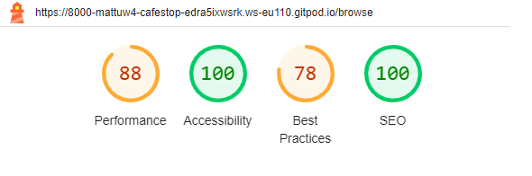

# Café Stops


Cafes stops is an online app designed to connect people interested in cycling and café culture. All users have access to browse and view published posts but users must be registered to interact with content e.g. make posts, like posts or comment. Registered users can submit posts to the site via a submission form and update or delete them from the site. Each post is viewable on the site following authorisation by admin. Posts have categories that link them together which users can search through.

[The deployed app can be found here]( https://cafe-stops-app-1a89f942fe7e.herokuapp.com/)

## Contents

1. [User Experience (UX)](#1-user-experience-ux)
2. [Agile Development](#2-agile-development)
3. [Design](#3-design)
4. [Features](#4-features)
5. [Technologies Used](#5-technologies-used)
6. [Local Development and Deployment](#6-local-development-and-deployment)
7. [Testing](#7-testing)
8. [Credits](#8-credits)

## 1. User Experience (UX)

### User Stories

#### Epic

- As a site user I can create, read, update and delete blog posts so that I can share cycling cafes
- As a site user I can register for an account so that I can access all the blog features.
- As a site admin I can manage the blog so that the integrity and quality is maintained.
- As a site user I can like/unlike a blog post so that I can interact with the site content.
- As a site user I can create, read, update and comments on posts so that I can add to discussion on cafes.
- As a site user I can use the site because it has a well designed user interface that makes a good user experience.
- As a site user I can use requisite software technologies so that I can interact with the cafe stop app

## 2. Agile Development

This project was developed using Agile methodology.

To manage the development process GitHub Issues and Projects including a Kanban board. MosCow approaches were used to determine must have, could have and should have features. Each part of the app is broken down into epics, user stories, tasks and acceptance criteria. Git hub milestones were also used to measure progress.


[The Project Kanban Board]( https://github.com/users/MattuW4/projects/5/views/1)

## 3. Design

### Structure


### Wireframes

- [index](documentation/images/general/WF Home.png) 
- [browse](documentation/images/general/WF Blog.png)
- [add post](documentation/images/general/WF Add.png)
- [post](documentation/images/general/WF Post.png)
- [sign_up](documentation/images/general/WF Sign.png)

### Colour Scheme


Cooler was utilised to select a colour scheme.

[Coolors](https://coolors.co/).

### Typography

[Google Fonts](https://fonts.google.com/) was used to add the fonts.

### Imagery and Icons

The images, icons and logo were chosen to give context and create something relatable

All icons were sourced from [Font Awesome](https://fontawesome.com/).

## 4. Features

### Navigation bar

### 'Home' Page

### 'Browse' Page

### ‘Categories’ Page

### Post Details Page

### Add/update Page

### User Authentication

### Admin Panel

### Error Pages

### Data Models

The site a relational database to store and manage data. The relational database management system software used for this project is [PostgreSQL](https://www.postgresql.org/). This is hosted on the cloud service [ElephantSQL](https://www.elephantsql.com/).

[insert images for above]

#### Post Model

#### Comment Model

#### Category Model

#### Entity Relationship Diagram

The Entity Relationship Diagram (ERD) below shows the database structure and relationships between tables.

[insert image]
### Static File Storage

Cloudinary cloud services were used to store static files. 

[insert image]

### Future features

- Add functionality for authenticated users to edit and delete comments.
- Add search functionality for fields across site
- Add a profile page 

## 5. Technologies Used

### Languages

- [HTML5](https://en.wikipedia.org/wiki/HTML5)
- [CSS3](https://en.wikipedia.org/wiki/CSS)
- [JavaScript](https://en.wikipedia.org/wiki/JavaScript)
- [Python](https://en.wikipedia.org/wiki/Python_(programming_language))

### Frameworks, Libraries and Packages

- [Django 3.2](https://docs.djangoproject.com/en/3.2/)
- [Bootstrap 5](https://getbootstrap.com/)
- [jQuery 3.2](https://releases.jquery.com/)
- [Font Awesome 5.15.4](https://fontawesome.com/)
- [Google Fonts](https://fonts.google.com/)
- [django-crispy-forms](https://django-crispy-forms.readthedocs.io/en/latest/)
- [cripsy-bootstrap5](https://github.com/django-crispy-forms/crispy-bootstrap5)
- [django-allauth](https://django-allauth.readthedocs.io/en/latest/)
- [django-dynamic-formset](https://github.com/elo80ka/django-dynamic-formset)
- [django-autoslug](https://django-autoslug.readthedocs.io/en/stable/)
- [coverage](https://coverage.readthedocs.io/en/7.2.7/)

### Tools

- [Git](https://git-scm.com/)
- [GitHub](https://github.com/)
- [CodeAnywhere](https://app.codeanywhere.com/)
- [Heroku](https://heroku.com/)
- [ElephantSQL](https://www.elephantsql.com/)
- [Cloudinary](https://cloudinary.com/)
- [Lucidchart](https://www.lucidchart.com/pages)
- [Coolors](https://coolors.co/)
- [CloudConvert](https://cloudconvert.com/)
- [Tiny PNG](https://tinypng.com/)
- [Am I Responsive](https://ui.dev/amiresponsive)
- [favicon.io](https://favicon.io/)
- [The W3C Markup Validation Service](https://validator.w3.org/)
- [The W3C CSS Validation Service](https://jigsaw.w3.org/css-validator/)
- [Code Institute Python Linter](https://pep8ci.herokuapp.com/)
- [JSHint](https://jshint.com/)
- [Chrome DevTools](https://developer.chrome.com/docs/devtools/)
- [Coverage](https://coverage.readthedocs.io/)

## 6. Local Development and Deployment

### Local Development

#### Forking the Repository

- Log in to GitHub.
- Go to the repository for this project (<https://github.com/MattuW4/cafe-stop>).
- In the top-right corner of the page, click "Fork".
- Under "Owner", select an owner for the repository from the dropdown menu.
- Optionally, in the "Description" field, type a description of your fork.
- To copy the main branch only, select the "Copy the main branch only" check box. If you do not select this option, all branches will be copied into the new fork.
- Click "Create fork"

#### Cloning Your Forked Repository

- Log-in to GitHub.com, navigate to your fork of the repository.
- Above the list of files, click Code.
- Copy the URL for the repository.
  - To clone the repository using HTTPS, under "Clone with HTTPS", click the "Copy" icon.
  - To clone the repository using an SSH key, including a certificate issued by your organization's SSH certificate authority, click SSH, then click the "Copy" icon.
  - To clone a repository using GitHub CLI, click Use GitHub CLI, then click the "Copy" icon.
- Open Git Bash
- Change the current working directory to the location where you want the cloned directory.
- Type git clone, and then paste the URL you copied earlier.
- Press Enter. Your local clone will be created.

For more details about forking and cloning a repository, please refer to [GitHub documentation](https://docs.github.com/en/get-started/quickstart/fork-a-repo).

#### Install Dependencies

Use the `pip install -r requirements.txt` command to install all of the Python modules and packages listed in your requirements.txt file.

#### Create your env.py

- In your project workspace, create a file called env.py and make sure this file is included in the .gitignore file.
- Add the following code:

```python
import os

os.environ["DATABASE_URL"]='<copiedURL>'
os.environ['SECRET_KEY'] = '<ADD YOUR SECRET KEY HERE>'
os.environ['CLOUDINARY_URL'] = '<API ENVIRONEMENT VARIABLE>'

```

- Replace `<ADD YOUR SECRET KEY HERE>` in the SECRET_KEY environment variable with your own secret key.
- Save the file.

#### Create a Database

- Create an account and log in with ElephantSQL.com.
- From the dashboard click “Create New Instance”.
- Set up your plan
  - Give your plan a Name
  - Select a plan tier
  - You can leave the Tags field blank
- Select “Select Region”
- Select a data center near you
- Then click “Review”
- Check your details are correct and then click “Create instance”
- Return to the ElephantSQL dashboard and click on the database instance name for this project
- In the URL section, click the copy icon to copy the database URL
- In your env.py file replace `<copiedURL>` in the DATABASE_URL environment variable with the copied URL.
- Save the file.

#### Set Up Cloudinary

- Create an account and log in with Cloudinary.com.
- In the dashboard copy your API Environment variable.
- In your env.py file replace `<API ENVIRONEMENT VARIABLE>` in the CLOUDINARY_URL environment variable with the copied API Environment variable.
- Save the file.

### Deployment

- The requirements.txt file in the project was updated to include details on the project dependencies. Steps to do this are :
  - Enter the following command at the terminal prompt : "pip3 freeze > requirements.txt"
  - Commit changes to requirements.txt and push to GitHub.
- In `setting.py`, add Heroku Hostname to ALLOWED_HOSTS.

```python
ALLOWED_HOSTS = ["PROJECT_NAME.herokuapp.com", "YOUR_HOSTNAME"]
```

- Make surea file named Procfile exists on the top level directory which contans the following code:

```python
web: gunicorn PROJECT_NAME.wsgi
```

- Commit changes and push to GitHub.
- Log in to Heroku, create an account if necessary.
- From the Heroku dashboard, click "Create new app". For a new account a button will be displayed on screen, if you already have one or more apps created a link to this function is located in the "New" dropdown menu at the top right of the screen.
- On the Create New App page, enter a unique name for the application and select region. Then click Create app.
- Select the "settings" tab and click the "Reveal Config Vars" button.
- Enter the following values into the specified fields and click "Add":

    | KEY | VALUE |
    |-----|-------|
    | CLOUDINARY_URL | paste your API Environment variable copied from the Cloudinary dashboard |
    | DATABASE_URL | paste the URL copied from ElephantSQL dashboard |
    | SECRET_KEY | paste your secret key |

- Select the "Deploy" tab.
- Select GitHub as the Deployment Method and click "Connect to GitHub".
- Enter the name of your GitHub repository in the search bar and click "Search".
- Click the "Connect" button to link your GitHub repository with your Heroku app.
- Scroll down the page and choose to either Automatically Deploy each time changes are pushed to GitHub, or Manually deploy.
- The application can be run from the Application Configuration page by clicking on the Open App button.

## 7. Testing

[Chrome DevTools](https://developer.chrome.com/docs/devtools/) was frequently utilised.

### Manual Functionality Testing

[insert manual testing doc]

### Browser Compatibility

The website was tested for functionality on different browsers (Chrome, Firefox and Edge). It was determined to be functional across all.

### Device Compatibility and Responsiveness

The app was tested on the following devices, using Chrome DevTools at different resolutions:

- iPhone SE
- iPhone 12 Pro
- Pixel 5
- Samsung Galaxy S8+
- Samsung Galaxy S20 Ultra
- iPad Air
- iPad Mini
- Surface Pro 7
- Surface Duo
- Galaxy Fold
- Samsung Galaxy A51
- Nest Hub
- Nest Hub Max
- iPad
- iPadPro

## W3C HTML Validator Testing

The [W3C Markup Validation Service](https://validator.w3.org/) was used to validate the HTML files.

![Validation] (documentation/testing/html-browse.png)
At the time of testing and deployment there was an error that could not be resolved by the developer with the read out shown below and caused a delay to submission and finalisation:

![Validation] (documentation/testing/html-error.png)

## W3C CSS Validator Testing

The [W3C CSS Validation Service](https://jigsaw.w3.org/css-validator/) was used to validate the CSS.


### Python Linter

The Code Institute Python Linter was used to validate and format the python files neatly. All errors were fixed with no errors in final deployment.

[insert linter images]

### JSHint JavaScript Validator Testing

### Lighthouse Auditing

Lighthouse audit reports were generated through Chrome DevTools to test the performance, accessibility, best practices and SEO of the website during the development of the website.

Lighthouse audit report is as follows:




#### Unit Tests and Coverage

The automated tests were written using Django's built-in testing framework which use Python's unittest module. By default Django uses SQLite for the app database, this was used for development purposes and performing automated tests. The test files can be found in the app directory.

The coverage report was generated using the [Coverage](https://coverage.readthedocs.io/) tool.


### Bugs Encountered

## 8. Credits

### Code

[Django Docs](https://docs.djangoproject.com/en/3.2/), [W3Schools](https://www.w3schools.com/) and [Bootstrap Docs](https://getbootstrap.com/docs/5.3/getting-started/introduction/) were frequently referred to in the development of this website:

- Code from Code Institute's CodeStar blog walkthrough project was used and modified to create the commenting feature.

### Content

The images featured on the app were sourced from [insert credits]

### Media

### Acknowledgements
Brian Macharia

